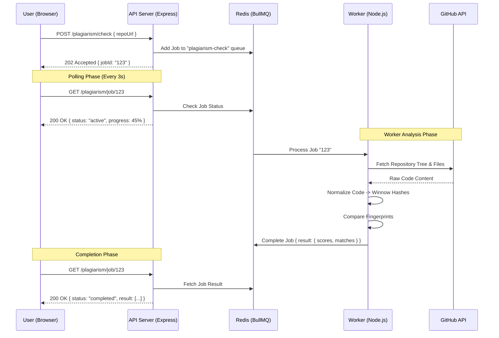

# 🏗️ RepoLens: Deep Technical Architecture & Algorithmic Guide

This document is the definitive guide for engineers who want to understand exactly how RepoLens works under the hood. It covers the technical flow, the data structures, and the mathematical foundations of our similarity engine.

---

## 🛰️ 1. Technical Request-Response Flow

RepoLens operates asynchronously to ensure the UI remains responsive even during 5-minute repository scans.

### 🔄 Full Sequence Diagram


---

## 🔬 2. The Similarity Algorithm (Winnowing)

The "Secret Sauce" of RepoLens is its ability to find copied code even if variables are renamed or formatting is changed. Here is the exact 4-step process:

### Step 1: Structural Normalization
We convert code into a generic "Skeleton".
- **Original**: `const myCounter = 10;`
- **Normalized**: `const V = N;`
- **Original**: `function calculate(a, b) { return a + b; }`
- **Normalized**: `function F(V, V) { return V + V; }`

### Step 2: K-gram Generation
We slide a window of `K` tokens across the normalized string. If `K=50`:
- We take tokens 1-50, 2-51, 3-52, and so on.
- This ensures small changes (like adding one line) only affect a few grams, keeping the overall signature stable.

### Step 3: Hashing & Winnowing
Each K-gram is hashed. However, storing every hash is too heavy. We use **Winnowing** to select only the most "important" hashes:
1. Divide hashes into **windows** of size `W`.
2. In each window, select the **minimum hash value**.
3. Use these selected hashes as the **Fingerprint**.

> **Why the minimum?** Mathematically, selecting the minimum hash ensures that if two files share a large identical block, they will inevitably select the same fingerprints for that block, regardless of where the block starts.

### Stage 4: Jaccard Similarity Comparison
Once we have fingerprints for `Repo A` and `Repo B`, we calculate the overlap:
- **Score** = `(Common Hashes) / (Total Unique Hashes)`
- If a repo has 100 fingerprints and 80 are found in the reference project, the score is **80%**.

---

## 📦 3. Internal Data Structures

### The Plagiarism Job Object (Redis/API)
```json
{
  "id": "123",
  "status": "completed",
  "data": { "repoUrl": "owner/repo" },
  "result": {
    "overallScore": 85,
    "breakdown": { "logic": 90, "structure": 80 },
    "matches": [
      { "file": "src/utils.js", "percentage": 95, "matchedWith": "ref/utils.js" }
    ]
  }
}
```

### The Analytics Object (API/Client)
```json
{
  "techStack": { "JavaScript": 75, "CSS": 25 },
  "activity": {
    "totalCommits": 150,
    "avgCommitGap": "4.5 hours",
    "topContributors": ["user1", "user2"]
  }
}
```

---

## 🛡️ 4. Security & Performance Policies

### GitHub API Strategy
We use a centralized `githubApi.js` utility. New developers **must** follow these rules:
1. **Authenticated Requests**: Always include the `Authorization` header via the `githubApi` instance.
2. **User-Agent**: Every request must have a `User-Agent` (set globally in `githubApi.js`).
3. **Graceful Failure**: If a repo is private or disabled, we catch the 404/403 and return a user-friendly error `{ success: false, error: "Repository not found" }` instead of crashing.

### Queue Concurrency
The worker is optimized for memory. In `plagiarismWorker.js`, we restrict:
- `concurrency: 2` (Processes only 2 repos at a time).
- `limiter: { max: 5, duration: 1000 }` (Ensures we don't spam GitHub).

---

## 🤝 5. Where to Start Contributing?

1.  **Backend Engineers**: Look at `src/utils/structuralNormalize.js` to add support for new languages (Java, Go, etc.).
2.  **Frontend Engineers**: Enhance the `SimilarityDistribution` chart or add a "Compare Mode" to the `Dashboard`.
3.  **DevOps**: Help us by adding a `docker-compose` setup to run the whole stack easily.

**Ready to start? See [CONTRIBUTING.md](./CONTRIBUTING.md) for the workflow steps.**
